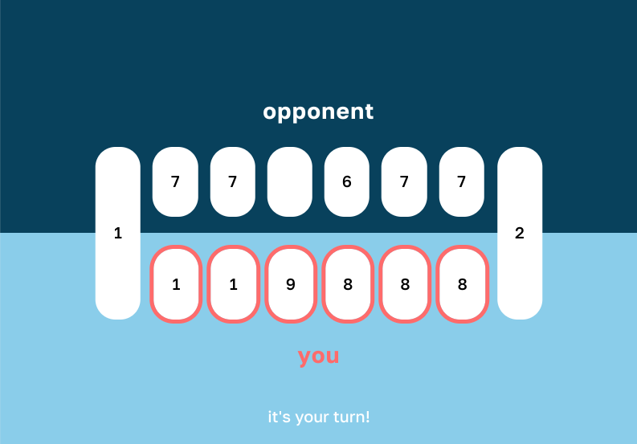

# Kalaha

This is an implementation of the technical assignment for a full stack developer role at [bol.com](http://bol.com). See the **rules of the game** in [this YouTube video](https://www.youtube.com/watch?v=F402u46ZTeM).

## Repository structure

This repository consists of 2 projects:

1. the backend, implemented with Java and Spring, ruled by `/pom.xml`
2. the frontend, implemented with Angular, ruled by `/frontend/.package.json`

## How to run

To play the game, run both the backend and the frontend on your local machine.

### System requirements

Before you type and hit the start commands, make sure your operating system has the following platforms & tooling installed. The versions given are versions used for this implementation. If you already use lower minor versions on your machine, the game might still run. If it doesn't, try upgrading to at least the version given below.

1. JDK 17
2. Maven 3.8.6
3. Node 16.16.0
4. Npm 8.11.0
5. Chrome 110.0.5481.181

### The steps

1. Run `mvn spring-boot:run` in `/` to start the backend.
2. Run `npm run start` in `/frontend` to start the frontend.
3. Open [localhost:4200](http://localhost:4200/) in Chrome. The frontend will open and connect automatically to the backend running on `localhost:8080`.
4. Open [localhost:4200](http://localhost:4200/) in another browser or different user profile in Chrome.
5. Connect the 2 players:
    1. Click _Start game_ in the first browser and copy the game code.
    2. Click _Join game_ in the second browser and paste the code. Click _Go_.
6. Now you can play!

## Tests

Both the backend and the frontend are covered with unit tests. You can run them as follows:

1. Run `mvn test` in `/` to execute the backend tests.
2. Run `npm run test` in `/frontend` to execute the frontend tests.

## Architectural overview

The fundaments of this implementation's architecture are as follows:

1. Players can play together each on their own machine, sharing the **state of the game** that exists on the server.
    1. One player can create a new game in his own backend session and another player can join it by referencing it with the **game's `code`**.
    2. Players share a game's `code` verbally or via any messaging app (like WhatsApp).
2. A player can **make a move**, changing the state of the game, by firing a REST API move request to the server.
    1. The server updates a game's state with a move according to the game rules that the **server is owner** of.
    2. The **frontend only presents** a game's state to the users and does not manage any game logic.
3. Both players are notified by the server about the game's state change via a **Web Socket live connection**.

## Other considerations

### Additional test coverage

Unit tests that exist in this implementation are exemplary and they demonstrate how I design unit tests both on the frontend and the backend. More unit tests, covering more cases and classes, would be needed in a final solution.

### Web Socket reliability

I have used the Web Sockets technology for the implementation of this game because it ideally fits the requirements allowing players to immediately see moves of the opponent and it avoids overloading network and server activity with superfluous polling.

However, the implementation of the Web Socket that I ended up using turned out to be unstable, that is the frontend occassionally does not make a successfull connection with the server and keeps on hanging.

A temporary solution for this problem, that I have implemented, is to retry the connection upon failure. In practise the connection succeeds after the first retry and makes it possible to play the game. In regular business circumstances I would use this temporary solution, as in the presentation of this assignment, to demo the game to the stakeholders and allow them to express feedback on the functionality. I would communicate this technical debt and work on resolving it in following sprints.

To achieve a stable and proper final implementation, I would change Spring Web Socket configuration to communicate over `ws://` instead of `http://` protocol and I would change frontend's Web Socket library to [@stomp/stompjs](https://www.npmjs.com/package/@stomp/stompjs), which does not allow `http://` and cannot be used with the current implementation.
